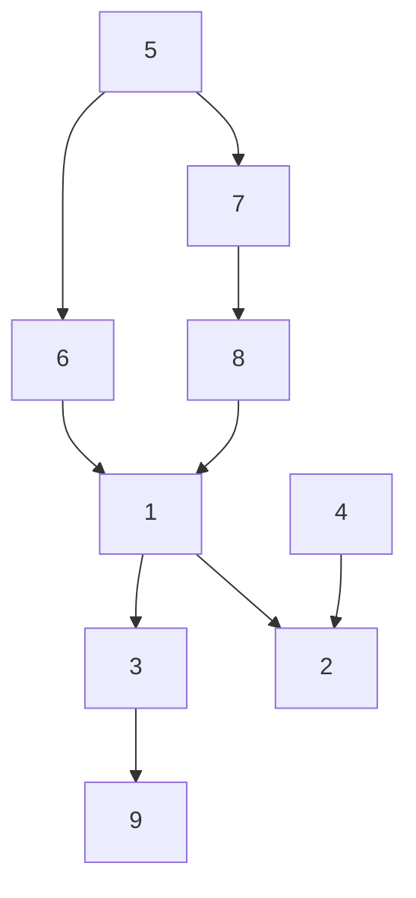
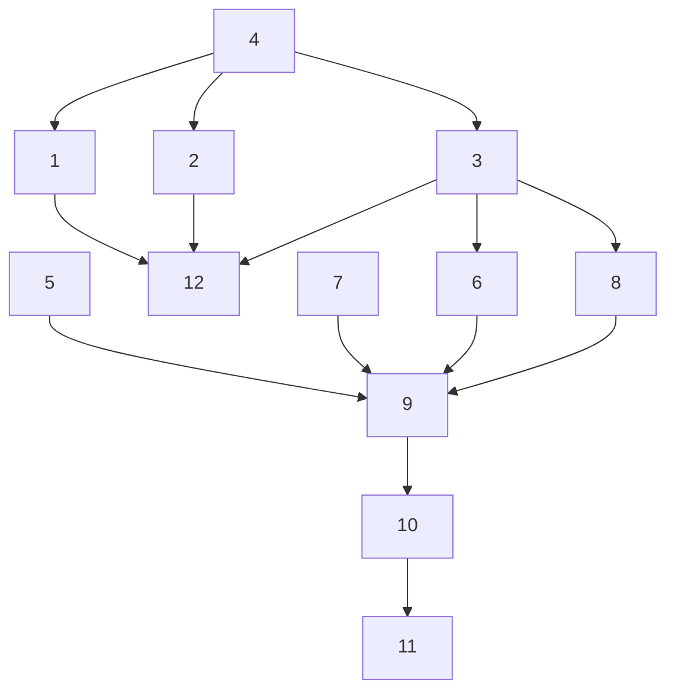

# Tasks for project completion

## Concept phase

1. ZKP verification working script
2. Tests for correctness of ZKP verification using BLS12-381 as a reference
3. YTxP wrapper for ZKP working script in Plutarch
4. Reference ZKP verification implementation using BLS12-381 primitives
5. Galois field operations and representations
6. Testing of Galois field representations (at the script level)
7. Elliptic curve operations and representations
8. Testing of elliptic curve operations (at the script level)
9. Documentation of YTxP wrapper for ZKP verification

These tasks have the following dependency graph:

## Product phase

The following task list assumes all concept phase tasks have been completed.

1. YTxP wrapper for ZKP working script in Aiken
2. YTxP wrapper for signature verification working script in Aiken
3. Expand Plutarch YTxP wrapper to include signature verification
4. Signature verification working script
5. Grumpkin curve ZKP conformance tests
6. Grumpkin curve signature conformance tests
7. Pasta curves ZKP conformance tests
8. Pasta curves signature conformance tests
9. Benchmarks for performance
10. Performance tuning
11. Audit
12. Documentation of Plutarch and Aiken YTxP wrappers

These tasks have the following dependency graph:

