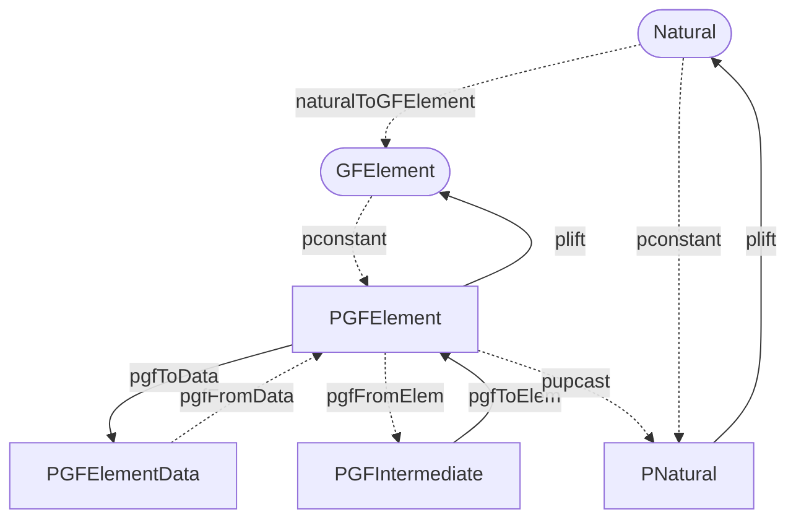

# Implementation of Galois fields for Grumplestiltskin

## Introduction

We implemented [Galois field][galois-field] functionality for Grumplestiltskin,
as required by Milestone 1. In particular, we defined the following in
`Grumplestiltskin.Galois`:

* SOP and `Data`-encoded types corresponding to elements of Galois fields
* Field operations for these types (addition, multiplication, additive and
  multiplicative inverses, exponentiation)
* Conversions between SOP and `Data`-encoded types for elements of Galois
  fields, as well as 'lifts' from more standard Haskell and Plutarch types

We made these definitions as efficient as possible, and as safe as reasonable.
In particular, we used `Integer` arithmetic for as many of the field operations
as we could, as well as the `ExpModInteger` Plutus primitive for multiplicative
inverses and exponentiation. We also provided two SOP-encoded types for field
elements, designed to reduce the number of modulo operations used.

To ensure correctness, we defined property tests in `test/galois/Main.hs` which
verify both correctness of Galois field operations and the stability and
round-tripping of the `Data`-encoded representation of Galois field elements.

## Goals and priorities

[TODO: Write]

## Types

`Grumplestiltskin.Galois` defines four data types:

* `GFElement`, which is a Haskell-level equivalent to `PGFElement`;
* `PGFElement`, representing an element of some Galois field, already in reduced
  form;
* `PGFIntermediate`, representing an 'intermediate computation' on
  `PGFElement`s; and
* `PGFElementData`, a `Data`-encoded version of `PGFElement`.

Of these types, `PGFIntermediate` has the richest API, supporting the full set
of field operations, while `PGFElement` and `PGFElementData` are more limited.

`GFElement` exists only to allow a `PLiftable` instance for `PGFElement` without
'overloading' an existing Haskell type. We did this both for clarity and for
safety: as any Haskell-level value must first be converted to a `GFElement`, we
can avoid unnecessary validation work onchain. The definition of `GFElement` is
straightforward:

```haskell
newtype GFElement = GFElement Natural
```

We chose not to store (or even represent) the order of the field whose element a
`GFElement` (or indeed, any type we have defined) stands for. We discuss this
choice in the 'Alternatives considered' section. The only noteworthy type class
instance for `GFElement` is `Arbitrary`, as we needed to choose some prime
order. We decided on `97`, as it is the largest prime number that's below 100,
which is the default size for generated `Integer`s (and thus, `Natural`s) for
QuickCheck. While not as general as possible, this choice was enough for our
testing.

### SOP-encoded

We provide two SOP-encoded types representing Galois field elements. Their
primary difference is that `PGFElement` is always in 'reduced form': more
precisely, `PGFElement`s must be non-negative numbers strictly smaller than the
order of their (implicit) field. `PGFIntermediate`, however, is not required to
be in 'reduced form', and can be much larger, or even negative.

[TODO: Continue]

### `Data`-encoded

We define a single `Data`-encoded type `PGFElementData` representing Galois field elements. The difference with its SOP-encoded version `PGFElement` is the addition of data of type `PPositive` representing a field's order. The data encoded version is supposed to be in a reduced form, where the field order of `PPositive` has to be larger than the `PNatural` representing the element.

[TODO: Fill in]

## Functions

[TODO: Fill in]

### Conversions

We provide a range of conversions between different Haskell and Plutarch types
and the types defined for Galois field elements. A summary of these
relationships is shown below; we represent low-cost conversions as dashed
arrows, while costly conversions are solid arrows. Plutarch types are in square
frames, while Haskell types are in round frames. The relationship between
`Natural` and `PNatural` is included for completeness: we do not define it.



Omitted from the above is the conversion between `PData` and `PAsData
PGFElementData`, which is provided by a combination of `pdata`, `pforgetData`,
`pasData` and the `PTryFrom` instance of `PGFElementData`. The `PTryFrom`
instance for `PGFElementData` is validating: specifically, it checks whether its
`PNatural` field is less than its `PPositive` element. More specifically, we can
be sure that any `PGFElementData` we receive will already be modulo reduced. We
do not check whether the `PPositive` representing field order is prime, as this
is unreasonable to do onchain.

To introduce `GFElement`s, we provide the `naturalToGFElement` function. This is
marked as low-cost, as it is entirely offchain. To promote `GFElement`s into
`PGFElement`s, we use the `PLiftable` instance of `PGFElement`, specifically the
`pconstant` function. If we want to do any computation, we can transform into
`PGFIntermediate` using `pgfFromElem`; this is nothing more than a `newtype`
rewrap and thus essentially has no cost. 

On the other hand, the conversion from the computations enabled type `PGFIntermediate` to `PGFElement` is enabled using `pgfToElem`; we have to explicitly provide the field order since it reduces the element using the modulo computation to its normalised form of `PGFElement`. This conversion should be used sparingly, only at the boundaries of an algorithm to reduce the number of modulo operations, potentially ramping up the computation costs. 

[TODO: Describe the rest]

### Field operations

Most field operations are provided via the `PAdditiveSemigroup`,
`PAdditiveMonoid`, `PAdditiveGroup`, `PMultiplicativeSemigroup` and
`PMultiplicativeMonoid` instances for `PGFIntermediate`. These are 
defined directly over the `PInteger` that `PGIntermediate` wraps, and are thus
as efficient as arithmetic over `PInteger`s would be. By using `PGFIntermediate`
for such operations, we avoid having to do one modulo reduction per operation;
instead, we perform the reduction only when we must, such as when converting to
`PGFElement`.

One operation in particular requires special treatment: exponentiation. By
extension, how we implement exponentiation also affects reciprocals and
division. While defining such an operation on `PGFIntermediate` is possible, it
is inefficient, as Plutus provides the `ExpModInteger` operation, which can
perform modular exponentiation using a single primitive. As this also includes a
modulo reduction, it makes sense to produce a `PGFElement` as a result, as we
would need to provide the field order anyway. This gives us the following:

```haskell
pgfExp :: Term s (PGFIntermediate :--> PInteger :--> PPositive :--> PGFElement)
pgfExp = punsafeCoerce pexpModInteger
```

We can use this to define `pgfRecip` to compute multiplicative inverses, and
thus, division can be performed as multiplication by the reciprocal. Like
`pgfExp`, `pgfRecip` must be given the field order as an argument, and thus also
produces a `PGFElement`. This isn't a significant limitation in practice, as we
can convert a `PGFElement` back into a `PGFIntermediate` for essentially zero
cost, and using the `ExpModInteger` primitive is much more efficient than
anything we could have defined ourselves. 

## Alternatives considered

[TODO: Fill in]

[galois-field]: https://en.wikipedia.org/wiki/Finite_field
