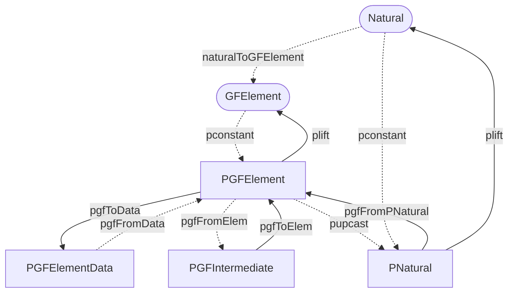

# Implementation of Galois fields for Grumplestiltskin

## Introduction

We implemented [Galois field][galois-field] functionality for Grumplestiltskin,
as required by Milestone 1. In particular, we defined the following in
`Grumplestiltskin.Galois`:

* SOP and `Data`-encoded types corresponding to elements of Galois fields
* Field operations for these types (addition, multiplication, additive and
  multiplicative inverses, exponentiation)
* Conversions between SOP and `Data`-encoded types for elements of Galois
  fields, as well as 'lifts' from more standard Haskell and Plutarch types

We made these definitions as efficient as possible, and as safe as reasonable.
In particular, we used `Integer` arithmetic for as many of the field operations
as we could, as well as the `ExpModInteger` Plutus primitive for multiplicative
inverses and exponentiation. We also provided two SOP-encoded types for field
elements, designed to reduce the number of modulo operations used.

To ensure correctness, we defined property tests in `test/galois/Main.hs` which
verify both correctness of Galois field operations and the stability and
round-tripping of the `Data`-encoded representation of Galois field elements.

## Goals and priorities

Our main priority is to implement the most efficient solution possible, by fully utilizing Plutarch's performance benefits. 
This will allow us to accurately determine whether the Grumplestiltskin suite can feasibly run on-chain.

The first goal is to implement optimised universal Galois field operations that are essential for implementing effective elliptic curve operations, critical for cryptographic functionality.

The following sections will describe the architecture of the Galois field module and decisions taken to stay aligned with our priorities.

## Types

`Grumplestiltskin.Galois` defines four data types:

* `GFElement`, which is a Haskell-level equivalent to `PGFElement`;
* `PGFElement`, representing an element of some Galois field, already in reduced
  form;
* `PGFIntermediate`, representing an 'intermediate computation' on
  `PGFElement`s; and
* `PGFElementData`, a `Data`-encoded version of `PGFElement`.

Of these types, `PGFIntermediate` has the richest API, supporting the full set
of field operations, while `PGFElement` and `PGFElementData` are more limited.

`GFElement` exists only to allow a `PLiftable` instance for `PGFElement` without
'overloading' an existing Haskell type. We did this both for clarity and for
safety: as any Haskell-level value must first be converted to a `GFElement`, we
can avoid unnecessary validation work onchain. The definition of `GFElement` is
straightforward:

```haskell
newtype GFElement = GFElement Natural
```

We chose not to store (or even represent) the order of the field whose element a
`GFElement` (or indeed, any type we have defined) stands for. We discuss this
choice in the 'Alternatives considered' section. The only noteworthy type class
instance for `GFElement` is `Arbitrary`, as we needed to choose some prime
order. We decided on `97`, as it is the largest prime number that's below 100,
which is the default size for generated `Integer`s (and thus, `Natural`s) for
QuickCheck. While not as general as possible, this choice was enough for our
testing.

### SOP-encoded

We provide two SOP-encoded types representing Galois field elements. Their
primary difference is that `PGFElement` is always in 'reduced form': more
precisely, `PGFElement`s must be non-negative numbers strictly smaller than the
order of their (implicit) field. `PGFIntermediate`, however, is not required to
be in 'reduced form', and can be much larger, or even negative.

### `Data`-encoded

We define a single `Data`-encoded type `PGFElementData` representing Galois field elements. 
The difference between `PGFElementData` and its SOP-encoded equivalent `PGFElement` is an extra field, of type `PPositive`, representing the order of the field this element belongs to. 
The data encoded version is supposed to be in a reduced form, where the field order of `PPositive` has to be larger than the `PNatural` representing the element. 
This constraint is defined in the decoding logic of the `PTryFrom` instance.

The decision to have the field order stored on-chain may be revisited later when we implement other modules of the suite. 
We may later choose to have the order implicit everywhere and pass the order from somewhere other than the elements.

## Functions

There are two categories of functions for our Galois field related data types.
First, there are conversion functions that handle conversions between individual data types and help maintain their specific invariants. 
Next, there are functions related to the Galois Field mathematical operations.

### Conversions

We provide a range of conversions between different Haskell and Plutarch types
and the types defined for Galois field elements. A summary of these
relationships is shown below; we represent low-cost conversions as dashed
arrows, while costly conversions are solid arrows. Plutarch types are in square
frames, while Haskell types are in round frames. The relationship between
`Natural` and `PNatural` is included for completeness: we do not define it.



Omitted from the above is the conversion between `PData` and `PAsData
PGFElementData`, which is provided by a combination of `pdata`, `pforgetData`,
`pasData` and the `PTryFrom` instance of `PGFElementData`. The `PTryFrom`
instance for `PGFElementData` is validating: specifically, it checks whether its
`PNatural` field is less than its `PPositive` element. More specifically, we can
be sure that any `PGFElementData` we receive will already be modulo reduced. We
do not check whether the `PPositive` representing field order is prime, as this
is unreasonable to do onchain.

To introduce `GFElement`s, we provide the `naturalToGFElement` function. This is
marked as low-cost, as it is entirely offchain. To promote `GFElement`s into
`PGFElement`s, we use the `PLiftable` instance of `PGFElement`, specifically the
`pconstant` function. If we want to do any computation, we can transform into
`PGFIntermediate` using `pgfFromElem`; this is nothing more than a `newtype`
rewrap and thus essentially has no cost. 

Next, we introduce a conversion `pgfFromPNatural` that converts `PNatural` to `PGFElement`, using a modulo operation as specified by a `PPositive` argument for the field order.
It provides functionality to fully stay in the Plutarch context and create the `PGFElement` without needing to do the conversion manually. 
Note that this conversion is marked as a higher cost operation because of doing modulo internally.

Lastly, the conversion from the computations enabled type `PGFIntermediate` to `PGFElement` is enabled using `pgfToElem`; we have to explicitly provide the field order since it reduces the element using the modulo computation to its normalised form of `PGFElement`. 
This conversion should be used sparingly, only at the boundaries of an algorithm to reduce the number of modulo operations, potentially ramping up the computation costs.

### Field operations

Most field operations are provided via the `PAdditiveSemigroup`,
`PAdditiveMonoid`, `PAdditiveGroup`, `PMultiplicativeSemigroup` and
`PMultiplicativeMonoid` instances for `PGFIntermediate`. These are 
defined directly over the `PInteger` that `PGIntermediate` wraps, and are thus
as efficient as arithmetic over `PInteger`s would be. By using `PGFIntermediate`
for such operations, we avoid having to do one modulo reduction per operation;
instead, we perform the reduction only when we must, such as when converting to
`PGFElement`.

One operation in particular requires special treatment: exponentiation. By
extension, how we implement exponentiation also affects reciprocals and
division. While defining such an operation on `PGFIntermediate` is possible, it
is inefficient, as Plutus provides the `ExpModInteger` operation, which can
perform modular exponentiation using a single primitive. As this also includes a
modulo reduction, it makes sense to produce a `PGFElement` as a result, as we
would need to provide the field order anyway. This gives us the following:

```haskell
pgfExp :: Term s (PGFIntermediate :--> PInteger :--> PPositive :--> PGFElement)
pgfExp = punsafeCoerce pexpModInteger
```

We can use this to define `pgfRecip` to compute multiplicative inverses, and
thus, division can be performed as multiplication by the reciprocal. Like
`pgfExp`, `pgfRecip` must be given the field order as an argument, and thus also
produces a `PGFElement`. This isn't a significant limitation in practice, as we
can convert a `PGFElement` back into a `PGFIntermediate` for essentially zero
cost, and using the `ExpModInteger` primitive is much more efficient than
anything we could have defined ourselves. 

## Alternatives considered

We've considered multiple alternatives and implementation details that we describe in this section:
- Having no intermediate type `PGFIntermediate` for computations
- Field order is being explicitly represented and carried by the element everywhere
- Type-tagging `PGFElement` with its field order
- Using only `PInteger` everywhere

The most significant optimisation comes from the fact that we have introduced the intermediate type `PGFIntermediate` for computations, deferring the reduction to be the last step in a computation where possible. 
The alternative was not to use the intermediate type, which would significantly increase the number of operations, since we'd be doing reduction at every step. 
Having `n` operations, we would do `n` reductions instead of a single reduction at the end when using the `PGFIntermediate`.  
Imagine `a`, `b`, `c` being numbers, `y` being the resulting element, and `x` being a field order; we pick the following formula `a + b * c = y mod x` as our example to demonstrate the difference. In case of no intermediate element, the calculation looks like this: `(a + (b * c) mod x) mod x = y`; Having two binary operations, we make two modulo operations on top of the addition and multiplication. 
However, in the case of an intermediate element, we can assume the calculation doesn't need modulo reduction at every step and can be done at the end, as displayed by our original formula: `a + b * c = y mod x`. The result `y` is equivalent in both cases, but one has done fewer operations than the other to achieve the result. However, in some cases, the reduction is unavoidable: for example, when calculating a reciprocal, the result is already reduced. In those situations, we chose to return results as `PGFElement`s. If we need further computations, converting a `PGFElement` to a `PGFIntermediate` is cheap, and this way, we don't 'lose' information about 'reducedness'.

Next, another alternative was to represent the field order in every `PGFElement`. This would be of little benefit, especially in combination with our use of `PGFIntermediate` to avoid reductions. We would have to pay an extra cost to store the field order in every field element, but would only use it in a few situations. While this would be safer, it would double the memory cost of all operations. Given that our Galois field arithmetic definitions would be part of higher-level operations on elliptic curves, we decided the penalty would be unacceptable here.

Another alternative would be having type tagging of `PGFElement`s with their
field order. In this alternative, our definition would look as follows:

```haskell
data PGFElement (order :: Natural) (s :: S) = PGFElement (Term s PNatural)
```

This would theoretically allow us to benefit from both the efficiency of not
storing the field order at the value level, as well as the safety of always
knowing the field order. 

If we had a statically-known order, this could be made to work by requiring a
type argument when decoding:

```
pgfFromData :: Term s PGFElementData -> Term s (PGFElement order)
```

This would use a combination of `natVal` and `pconstant` to retrieve the
`Natural` corresponding to `order`, then compare the result to the field order
encoded in `PGFElementData`, erroring if it fails. However, the purpose of the
Grumplestiltskin project is to be able to work in _any_ required Galois field;
thus, we cannot assume that the code would have statically know the field order.
In this case, we would have to somehow 'promote' the `PPositive` stored in
`PGFElementData` to the correct type-level `Natural`, which is not possible for
two reasons:

* This technique requires dependent typing, which [GHC does not
  support][dependent-typing]; and
* The only way to 'translate' a Plutarch type into its Haskell equivalent is by
  using `plift`. As this involves running the Plutus abstract machine (and thus,
  cannot be done onchain), this is not viable.

Thus, we cannot have this kind of safety, and instead chose the approach we
described previously. However, to achieve at least some type safety, we chose to
use `PPositive` and `PNatural` over `PInteger` for as much of the API as
possible. While this does carry some cost, both in terms of extra work on the
codebase and in terms of performance, this gives us at least some guarantees of
correctness which can be checked by the compiler.

[galois-field]: https://en.wikipedia.org/wiki/Finite_field
[dependent-typing]: https://wiki.haskell.org/Dependent_type
